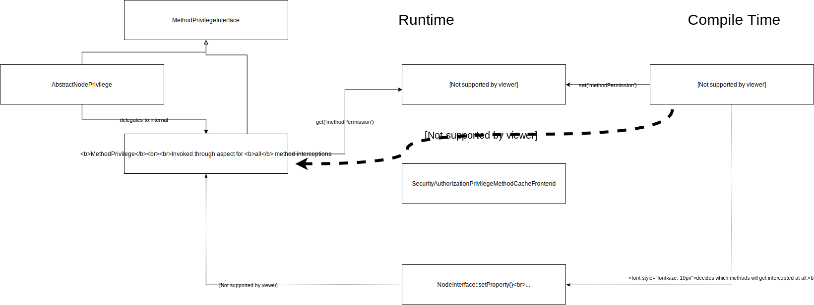

# Sandstorm Neos ACL

THIS IS NO WORKING CODE YET, BUT SHARED HERE FOR DEV PURPOSES SO FAR.

## Development 

**Initial (Package) Setup**

- clone this package as "Sandstorm.NeosAcl" in the DistributionPackages of a Neos 4.2 or later installation
- add it to `composer.json` as `"sandstorm/neosacl": "*"`
- run `composer update`
 
**Initial React Setup**

```
cd Resources/Private/react-acl-editor
yarn dev
```

**You need to START THE REACT DEVELOPMENT SERVER at every time you are developing the application** (using `yarn start`).

Then, log into the backend of Neos, and visit the module "Dynamic Roles".

### TODO list

- [ ] build dynamic ACL Privilege Matcher editor
    - [ ] remove hard-coded node types in PermissionWidget and pass them in via JSON (in index.tsx) from the enclosing site
    - [ ] allow to select a Node
        - [ ] build backend endpoint for node search (based on NodeSearchService)
        - [ ] use this endpoint in the component
    - [ ] send the generated Privilege Matchers as JSON as part of the outer form
    - [ ] initialize the Privilege Matchers in React from the outer form (in index.tsx)
    - [ ] fix React CSS styling to work with Neos Backend
    - [ ] include the statically-built JS files in production mode
- [ ] fully implement DynamicRoleGeneratorService
- [ ] visualize DENY in Permission Browser
- [ ] add proper README with usage instructions


## Internal Implementation Details

### Implementing Dynamic Node Privileges and MethodPrivileges

The basic idea was the following: Hook into `PolicyService::emitConfigurationLoaded`, and modify the `$configuration` array (introduce new roles
and privilegeTargets). This basically works **at runtime** - however there is a problem with dynamic MethodPrivilege enforcement, which is
explained below and by the following diagram:



#### How do Method Privileges Work

- Background: An implementation of `PointcutFilterInterface` can, during compile time of Flow, decide which classes
  and methods match for a certain aspect.
  - This is used in `PolicyEnforcementAspect` (which is the central point for enforcing **Method Privileges**).
  - There, the `MethodPrivilegePointcutFilter` is referenced.
  - The `MethodPrivilegePointcutFilter` asks the `PolicyService` for all configured `MethodPrivilege`s - and ensures
    AOP proxies are built for these methods.
- **Side Effect**: Now, during building up the pointcut filters, the `MethodPrivilegePointcutFilter` **additionally** builds up
  a data structure `methodPermissions` - which remembers for which method which `MethodPrivileges` are registered.
  - This data structure is stored **persistently in the `Flow_Security_Authorization_Privilege_Method` cache**.
  - At runtime, for a class which is intercepted by `PolicyEnforcementAspect`, all configured `MethodPrivilege`s are
    invoked - and they have to quickly decide if they match **this particular call-site**.
  - This is done using the `methodPermissions` data structure from the `Flow_Security_Authorization_Privilege_Method` cache.

#### What's the problem with dynamically added MethodPrivileges

- If a `MethodPrivilege` is defined dynamically at runtime, then the `methodPermissions` data structure is missing
  the information that this new privilege should be invoked for certain methods.
- NOTE: You can only dynamically add `MethodPrivileges` for call-sites **which are already instrumented by AOP**;
  because otherwise the code will never get invoked (because of missing proxies).

We are mostly working with `EditNodePrivilege` etc - so why does this apply there?

- `EditNodePrivilege` has an internal `MethodPrivilege` **which takes care of the method-call enforcement part**;
  i.e. preventing you to call e.g. `NodeInterface::setProperty()` if you do not have the permission to do so.

Furthermore, to make this idea work, the `Policy.yaml` of this package defines a catch-all `Sandstorm.NeosAcl:EditAllNodes`
PrivilegeTarget - so AOP will instrument the corresponding methods of `NodeInterface`. This catch-all makes sense
in any case, because this switches the security framework [to a whitelist-only approach](https://docs.neos.io/cms/manual/backend-permissions/real-world-examples#user-rights-for-part-of-a-page-tree)
- making it easier to grasp.

#### The Goal

In order to make the dynamic policy enforcement work, we need to add custom stuff to the `methodPermissions` - for
the dynamically-added roles.

#### Implementation

   
